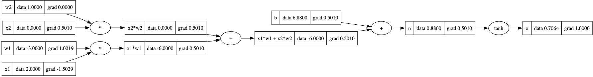
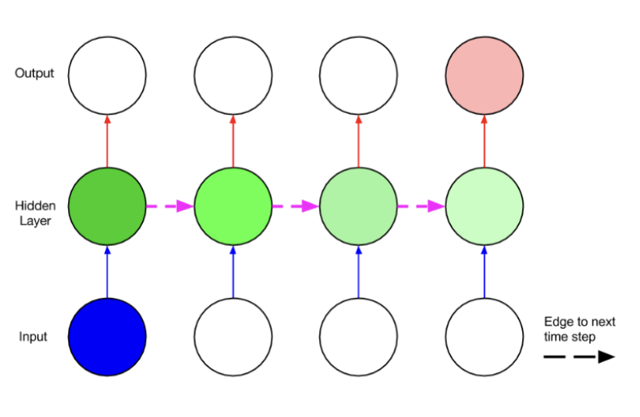
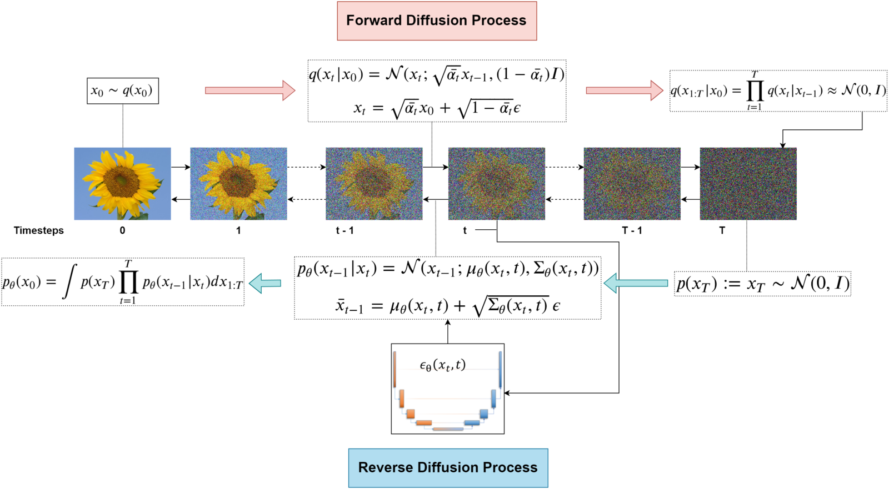

# deep learning

A progressive exploration through the evolution of deep learning, focusing on Computer Vision and Computational Imaging. This repository follows the exciting path from foundational neural networks to cutting-edge generative models and 3D representations.

> [!IMPORTANT]
>
> **This repository tells the story of deep learning's evolution through hands-on implementation.**
>
> Each section reveals how limitations in previous approaches sparked innovations that pushed the field forward, giving you insight into not just how these models work, but why they were developed.

> [!NOTE]
>
> All implementations use open-source datasets with detailed Jupyter Notebooks that explain both theory and practice.
>
> Seminal papers are included in each section to connect implementations with their academic foundations.

## Table of Contents

- [Deep Neural Networks](#deep-neural-networks)
- [Optimization & Regularization](#optimization--regularization)
- [Sequence Modeling](#sequence-modeling)
- [Vision & Representation](#vision--representation)
- [Advanced Vision](#advanced-vision)
- [Getting Started](#getting-started)
- [Dependencies](#dependencies)

# The Evolution of Deep Learning

Deep learning has transformed from simple perceptrons to complex architectures capable of understanding and generating visual content. This journey reveals how each breakthrough addressed specific limitations of previous approaches.

The early days focused on basic neural networks, struggling with optimization challenges. As researchers solved these problems, architectures evolved to handle increasingly complex data types - from tabular data to sequences, and finally to rich visual information.

What began with simple classification tasks has evolved into systems that can generate photorealistic images, understand 3D environments, and bridge the gap between vision and language.

# Deep Neural Networks

<p align="center">
  
</p>

## Custom Autograd Engine

Our journey begins at the foundation: understanding how neural networks learn through gradient-based optimization.

By implementing a custom automatic differentiation engine, we reveal the mathematical machinery that powers all deep learning systems. This implementation traces computational graphs and efficiently calculates gradients for arbitrary operations.

When applied to the [Two Moons dataset](https://scikit-learn.org/stable/modules/generated/sklearn.datasets.make_moons.html), we see how even simple networks can learn complex, non-linear decision boundaries - the first hint of the power that lies in these approaches.

Learn more about automatic differentiation in [Automatic Differentiation in Machine Learning: a Survey](https://arxiv.org/abs/1502.05767) and [Calculus on Computational Graphs](https://colah.github.io/posts/2015-08-Backprop/).

## Convolutional Neural Networks

The leap from fully-connected networks to CNNs marked a critical insight: incorporating domain knowledge (like the spatial structure of images) into architecture design.

CNNs introduced three revolutionary concepts: local receptive fields capture nearby pixel relationships; weight sharing dramatically reduces parameters while ensuring translation invariance; and pooling operations create hierarchical representations.

These innovations enabled networks to effectively process images without requiring millions of examples, demonstrating how the right inductive biases can make learning far more efficient.

Explore the fundamentals in [CS231n: Convolutional Neural Networks for Visual Recognition](http://cs231n.stanford.edu/) and the groundbreaking paper [ImageNet Classification with Deep Convolutional Neural Networks](https://papers.nips.cc/paper_files/paper/2012/hash/c399862d3b9d6b76c8436e924a68c45b-Abstract.html).

## LSTM Networks

As deep learning tackled sequential data, vanilla RNNs proved insufficient for modeling long-range dependencies.

LSTMs solved this through carefully designed memory cells with gating mechanisms that control information flow. This allowed networks to selectively remember information over many time steps.

Applying these networks to stock price forecasting demonstrates their ability to capture patterns across varying time scales - a capability that transformed everything from speech recognition to language modeling.

See the original [LSTM paper](https://www.bioinf.jku.at/publications/older/2604.pdf) and [Understanding LSTM Networks](https://colah.github.io/posts/2015-08-Understanding-LSTMs/) for intuitive explanations.

## AlexNet

In 2012, AlexNet dramatically outperformed traditional computer vision approaches on ImageNet, announcing the arrival of the deep learning era in computer vision.

Its design included critical innovations: deeper architectures with multiple convolutional layers; ReLU activations to combat vanishing gradients; and regularization techniques like dropout to improve generalization.

Training this network on the [CelebA dataset](https://mmlab.ie.cuhk.edu.hk/projects/CelebA.html) showcases how effectively it extracts hierarchical visual features - from simple edges to complex patterns - that transfer well across visual tasks.

Read the original [AlexNet paper](https://papers.nips.cc/paper_files/paper/2012/hash/c399862d3b9d6b76c8436e924a68c45b-Abstract.html) and explore [ImageNet](https://www.image-net.org/), the dataset that revolutionized computer vision research.

## U-Net Architecture

Image segmentation posed a unique challenge: networks needed to both understand global context and preserve precise spatial information.

U-Net's elegant solution combined a contracting path (encoder) that captures context with an expanding path (decoder) that recovers spatial information. The crucial innovation was skip connections that preserve fine details otherwise lost during downsampling.

Applications to the [Carvana dataset](https://www.kaggle.com/c/carvana-image-masking-challenge) demonstrate how this architecture achieves pixel-perfect segmentation, enabling applications from medical imaging to autonomous driving.

Study the original [U-Net paper](https://arxiv.org/abs/1505.04597) and [Segmentation models with pretrained backbones](https://github.com/qubvel/segmentation_models).

# Optimization & Regularization

As networks grew deeper, training them effectively became increasingly challenging. This section explores the techniques that made deep learning practical.

## Weight Regularization

Larger networks came with a critical risk: overfitting to training data.

L1 and L2 regularization (Weight Decay) address this by penalizing large weights during training. This encourages the network to find simpler solutions that generalize better to unseen data.

Experiments show how these techniques not only improve test performance but also create more interpretable feature extractors that focus on genuinely important patterns.

Learn about regularization theory in [Understanding Deep Learning Requires Rethinking Generalization](https://arxiv.org/abs/1611.03530) and practical implementations in [Regularization for Deep Learning](https://www.deeplearningbook.org/contents/regularization.html).

## Activation Functions

The choice of activation function dramatically impacts network training dynamics and representations.

ReLU (Rectified Linear Unit) addressed the vanishing gradient problem that plagued early deep networks. Newer variants like GELU, Swish, and SELU further refined these properties.

Comparative implementations reveal how each function affects gradient flow and feature sparsity, with visualizations showing the often subtle but important differences in their behavior.

Explore activation functions in [GELU paper](https://arxiv.org/abs/1606.08415), [Swish paper](https://arxiv.org/abs/1710.05941), and [SELU paper](https://arxiv.org/abs/1706.02515).

## Skip Connections & Residuals

As networks grew to hundreds of layers, training became increasingly difficult due to vanishing gradients and degradation problems.

Skip connections created shortcuts for gradient flow that enabled truly deep architectures. ResNets demonstrated the surprising finding that having the network learn residual mappings (differences from identity) was far more effective than learning direct mappings.

This seemingly simple architectural change enabled training of extremely deep networks, showing how thoughtful design can overcome fundamental optimization challenges.

Dive into the revolutionary [ResNet paper](https://arxiv.org/abs/1512.03385), [Highway Networks](https://arxiv.org/abs/1505.00387), and [DenseNet](https://arxiv.org/abs/1608.06993).

## Normalization Techniques

Internal covariate shift - where layer inputs continuously change during training - posed a major obstacle to efficient learning.

Batch Normalization addressed this by normalizing activations using batch statistics. Layer Normalization and Group Normalization provided alternatives suited to different types of data and batch sizes.

Experiments reveal how these techniques not only accelerate training but also act as implicit regularizers, improving generalization across architectures.

Study the original papers on [Batch Normalization](https://arxiv.org/abs/1502.03167), [Layer Normalization](https://arxiv.org/abs/1607.06450), and [Group Normalization](https://arxiv.org/abs/1803.08494).

## Optimizers

The journey from simple gradient descent to adaptive optimization methods marks a key advance in training efficiency.

Modern optimizers like Adam combine momentum with per-parameter learning rates, enabling faster convergence even on challenging loss landscapes.

Visualizations of optimization trajectories demonstrate how these methods navigate difficult terrain, escaping saddle points and finding better minima than simpler approaches.

Explore optimization methods in [Adam paper](https://arxiv.org/abs/1412.6980), [AdamW paper](https://arxiv.org/abs/1711.05101), and [Visualization of the Loss Landscape](https://arxiv.org/abs/1712.09913).

## Learning Rate Schedulers

The learning rate - perhaps the most important hyperparameter - need not remain fixed throughout training.

Strategies like Cyclic Learning Rates and Warm Restarts periodically vary the learning rate, allowing models to both converge to good solutions and escape suboptimal local minima.

One-Cycle scheduling demonstrates the surprising finding that temporarily increasing learning rates can lead to "super-convergence," dramatically reducing training time without sacrificing performance.

Learn about advanced scheduling in [Cyclical Learning Rates](https://arxiv.org/abs/1506.01186), [SGDR: Stochastic Gradient Descent with Warm Restarts](https://arxiv.org/abs/1608.03983), and [Super-Convergence](https://arxiv.org/abs/1708.07120).

# Sequence Modeling

<p align="center">
  
</p>

## Bigrams

The simplest approach to sequence modeling relies on classical statistics rather than neural networks.

Bigram models estimate the probability of each token given only the previous token, creating a first-order Markov model of sequences.

Despite their limitations, these models establish important baselines and introduce core concepts like maximum likelihood estimation that underpin more sophisticated approaches.

Explore classical language models in [Speech and Language Processing](https://web.stanford.edu/~jurafsky/slp3/) and [N-gram Language Models](https://web.stanford.edu/~jurafsky/slp3/3.pdf).

## Multi-Layer Perceptrons for Sequences

Can we adapt standard feedforward networks to handle sequential data?

Fixed-context window approaches attempt this by feeding the network a fixed number of previous tokens to predict the next one. While simple, this approach struggles to capture dependencies beyond its fixed window size.

These limitations highlight why specialized architectures are needed for sequential data, setting the stage for recurrent models.

Learn about early neural approaches in [A Neural Probabilistic Language Model](https://www.jmlr.org/papers/volume3/bengio03a/bengio03a.pdf) and [Neural networks for sequence processing](https://ieeexplore.ieee.org/document/279181).

## Recurrent Neural Networks

RNNs introduce the fundamental concept of maintaining state across processing steps, enabling theoretically unlimited context.

By feeding back hidden states from previous steps, these networks can process variable-length sequences with a fixed number of parameters. Training through backpropagation through time (BPTT) allows the network to learn from sequence history.

However, experiments reveal practical limitations - as sequences grow longer, gradients tend to either vanish or explode, making learning long-range dependencies difficult.

Explore RNN fundamentals in [The Unreasonable Effectiveness of Recurrent Neural Networks](https://karpathy.github.io/2015/05/21/rnn-effectiveness/) and [Learning Long-Term Dependencies with Gradient Descent is Difficult](https://ieeexplore.ieee.org/document/279181).

## Gated Recurrent Units

To address the gradient problems in vanilla RNNs, gated architectures introduced controlled information flow.

GRUs use update and reset gates to determine what information to keep from previous states and how to combine it with new inputs. This selective memory mechanism allows much better modeling of long-range dependencies.

With fewer parameters than LSTMs but similar performance on many tasks, GRUs demonstrate how architectural innovation can create more efficient models.

Study GRUs in the original [GRU paper](https://arxiv.org/abs/1406.1078) and [Empirical Evaluation of Gated Recurrent Neural Networks on Sequence Modeling](https://arxiv.org/abs/1412.3555).

# Vision & Representation

Modern computer vision required moving beyond simple feature extraction to sophisticated representation learning.

## Attention Mechanisms

Attention mechanisms revolutionized how networks process information by allowing dynamic, content-based focusing.

In visual contexts, attention enables networks to selectively emphasize relevant parts of an image while downplaying others. Self-attention creates relationships between all positions in feature maps, capturing long-range dependencies that convolutional operations miss.

Visualizing attention maps reveals how networks learn to focus on semantically meaningful regions without explicit supervision.

Learn about visual attention in [Show, Attend and Tell](https://arxiv.org/abs/1502.03044), [Attention Is All You Need](https://arxiv.org/abs/1706.03762), and [Non-local Neural Networks](https://arxiv.org/abs/1711.07971).

## Self-Supervised Learning

How can we learn good visual representations without relying on expensive labeled data?

Self-supervised approaches like BYOL, SimCLR, and MoCo generate supervisory signals from the data itself. By learning to match differently augmented views of the same image, these methods learn surprisingly powerful representations.

Experiments show how these approaches can sometimes match or even exceed supervised pretraining, demonstrating that the structure of visual data itself contains rich information.

Explore self-supervised learning in [SimCLR](https://arxiv.org/abs/2002.05709), [BYOL](https://arxiv.org/abs/2006.07733), and [MoCo](https://arxiv.org/abs/1911.05722).

# Advanced Vision

<p align="center">
  
</p>

## Diffusion Models

Diffusion models represent a fundamentally different approach to generation than previous methods.

By gradually adding noise to images and then learning to reverse this process, these models create a well-behaved path between random noise and complex data distributions.

The implementation demonstrates denoising diffusion probabilistic models (DDPM) and their application to image generation, revealing how seemingly simple Gaussian noise transitions can create remarkably complex and realistic outputs.

Dive into diffusion models with [DDPM](https://arxiv.org/abs/2006.11239), [Diffusion Models Beat GANs on Image Synthesis](https://arxiv.org/abs/2105.05233), and [Stable Diffusion](https://stability.ai/stable-diffusion).

## Generative Adversarial Networks

GANs introduced the powerful concept of adversarial training - pitting a generator network against a discriminator in a minimax game.

This adversarial process forces the generator to create increasingly realistic samples to fool the discriminator. While incredibly powerful, GANs often suffer from training instabilities and mode collapse.

StyleGAN implementations demonstrate how architectural innovations addressed these challenges, enabling unprecedented control over generated content through style-based synthesis.

Explore the GAN world through the [original GAN paper](https://arxiv.org/abs/1406.2661), [StyleGAN](https://arxiv.org/abs/1812.04948), and [Progressive Growing of GANs](https://arxiv.org/abs/1710.10196).

## Neural Radiance Fields (NeRF)

NeRFs marked a breakthrough in novel view synthesis by representing scenes as continuous functions rather than discrete voxels or meshes.

By encoding a scene as an MLP that maps 3D coordinates and viewing directions to color and density, NeRFs can render photorealistic novel views from sparse input images.

The implementation demonstrates differentiable rendering and volumetric integration, showing how deep learning can bridge computer vision and graphics to create stunning 3D reconstructions from 2D images.

Discover NeRF through the [original NeRF paper](https://arxiv.org/abs/2003.08934), [NeRF: Representing Scenes as Neural Radiance Fields for View Synthesis](https://www.matthewtancik.com/nerf), and [Instant NGP](https://nvlabs.github.io/instant-ngp/).

## Implicit Neural Representations

The latest frontier in visual representation uses neural networks to directly represent continuous signals.

Unlike traditional approaches using discrete representations (pixels, voxels, meshes), these methods encode entire signals as the weights of coordinate-based MLPs. Special periodic activation functions like SIRENs enable these networks to capture high-frequency details.

Applications range from super-resolution to 3D reconstruction, showing how neural networks can serve not just as processing pipelines but as the representations themselves.

Learn about these cutting-edge approaches in [SIREN](https://arxiv.org/abs/2006.09661), [NeRF++](https://arxiv.org/abs/2010.07492), and [Neural Volumes](https://research.facebook.com/publications/neural-volumes-learning-dynamic-renderable-volumes-from-images/).

# Getting Started

1. Clone the repository:
```bash
git clone https://github.com/ahitagnied/deep-learning.git
```

2. Navigate to the project directory:
```bash
cd deep-learning
```

3. Install the required Python packages:
```bash
pip install -r requirements.txt
```

4. Each subdirectory contains Jupyter Notebooks demonstrating implementation and training. Follow the instructions in each notebook to reproduce results.

# Dependencies

The repository relies on the following Python libraries:

1. **[PyTorch](https://pytorch.org/)**: Primary deep learning framework
2. **[NumPy](https://numpy.org/)**: Numerical computing
3. **[Pandas](https://pandas.pydata.org/)**: Data manipulation
4. **[Matplotlib](https://matplotlib.org/)**: Visualization
5. **[Scikit-learn](https://scikit-learn.org/)**: Data preprocessing and metrics
6. **[TensorFlow](https://www.tensorflow.org/)**: Used for specific implementations
7. **[Torchvision](https://pytorch.org/vision/stable/index.html)**: Image datasets and transforms
8. **[Graphviz](https://graphviz.org/)**: Computational graph visualization
9. **[tqdm](https://github.com/tqdm/tqdm)**: Progress bars

The journey from basic neural networks to cutting-edge vision models reveals not just how deep learning works, but why each innovation was necessary. By understanding this evolution, you'll develop the intuition needed to push the field even further.

Contributions welcome! Please open an issue or submit a [pull request](https://github.com/ahitagnied/deep-learning/pulls).
